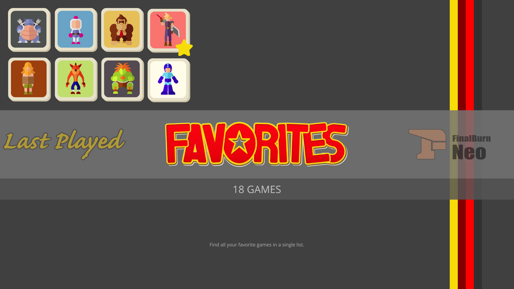
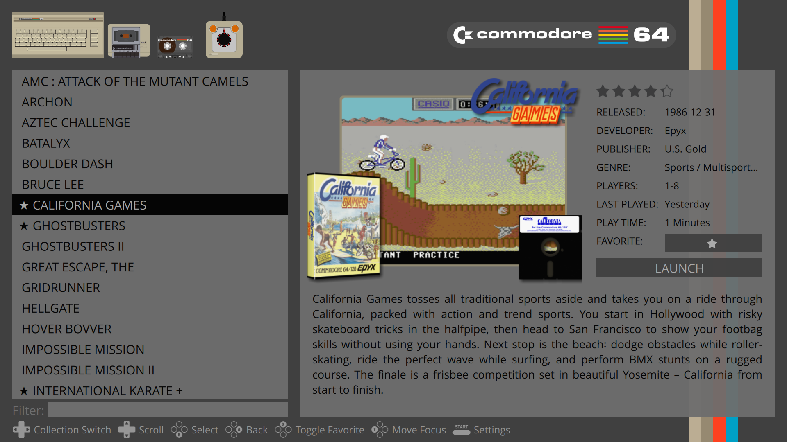

# Slatest theme for [Pegasus Frontend](https://pegasus-frontend.org/)

This is forked from the [nicjansma](https://github.com/nicjansma/pegasus-theme-slate-es-de) slate theme.

So far I've added:

* Favorites Collection. Toggle a game's favorite status with the "F" key or filter button.
* Last Played collection.
* Game Description can be focused and scrolled.
* All Games collection
* Game List filtering
* Focus Game Art and cycle through other images (if available) with Enter key or Select button.
* Use TAB, or Details button, to cycle focus between Game List, Filter, Description, and Game Art.
* Some layout tweaks

Notes:

* Tested system art with dummy roms and all-in-one `metadata.pegasus.txt`: [pegasus-frontend-dummy-roms](https://github.com/LeeBigelow/pegasus-frontend-dummy-roms)
* Game art mixed image screenshots generated by: [Skyscraper](https://github.com/Gemba/skyscraperr)
* The same carousel interface with a retro Commodore feel: [Pegasus Amiga Workbench Theme](https://github.com/LeeBigelow/pegasus-theme-amiga-workbench)
---

This is a port of the [slate-es-de](https://gitlab.com/es-de/emulationstation-de/-/tree/master/themes/slate-es-de) theme from EmulationStation-DE.

It's based off of work from [Mátyás Mustoha](https://github.com/mmatyas) for the [pegasus-theme-es2-simple](https://github.com/mmatyas/pegasus-theme-es2-simple/) theme.

## Installation

[Download](https://github.com/LeeBigelow/pegasus-theme-slatest/archive/master.zip) and extract to your [theme directory](http://pegasus-frontend.org/docs/user-guide/installing-themes). You can then select the theme in the settings menu of Pegasus.

## License

## Credits

* Forked from [nicjansma](https://github.com/nicjansma/pegasus-theme-slate-es-de)
* Forked from [pegasus-theme-es2-simple](https://github.com/mmatyas/pegasus-theme-es2-simple/)
* System images and colors from [EmulationStation-DE](https://gitlab.com/es-de/emulationstation-de/-/tree/master/themes/slate-es-de)
* SVGs were ran through [scour](https://github.com/scour-project/scour) to fix SVG support in Pegasus which uses [SVG Tiny 1.2](https://github.com/mmatyas/pegasus-frontend/issues/870)
